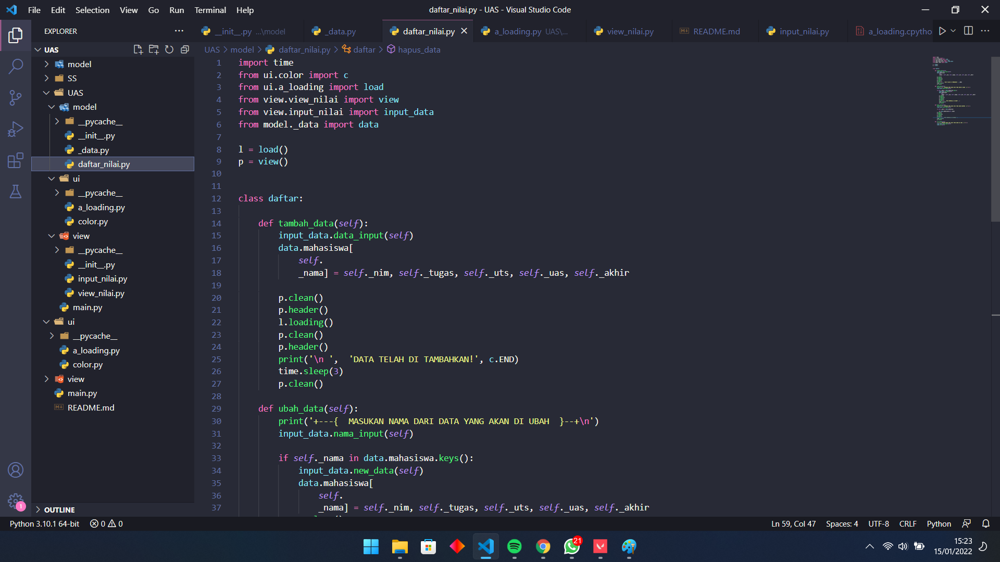
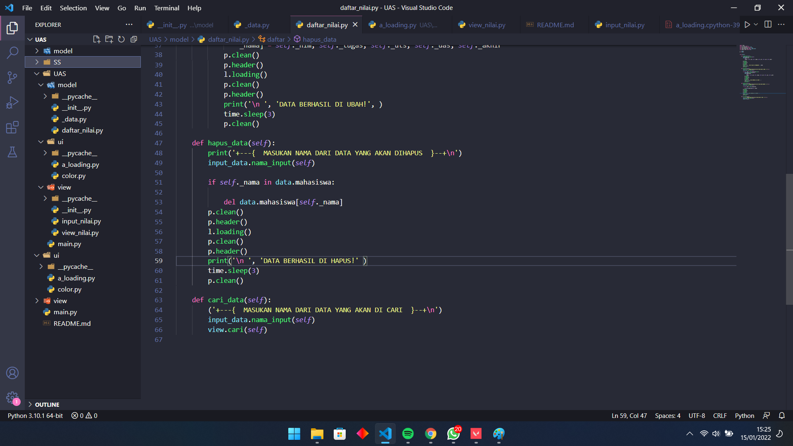
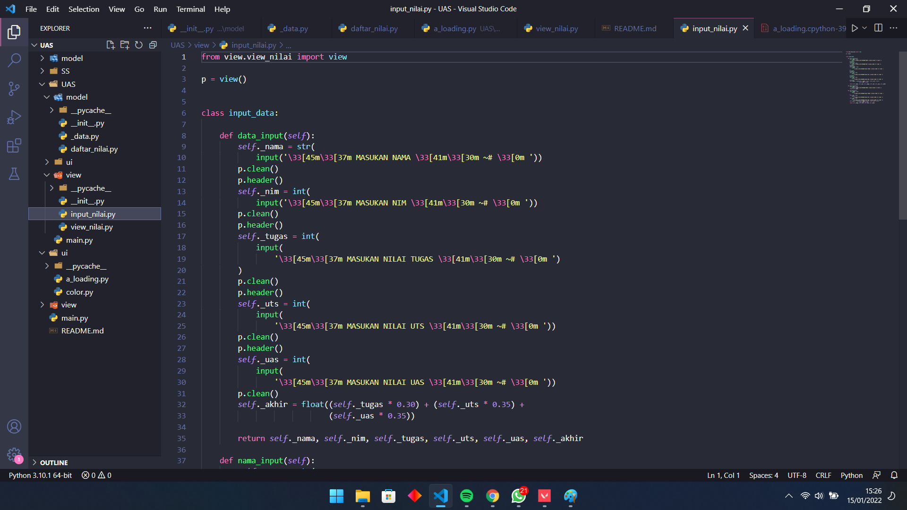
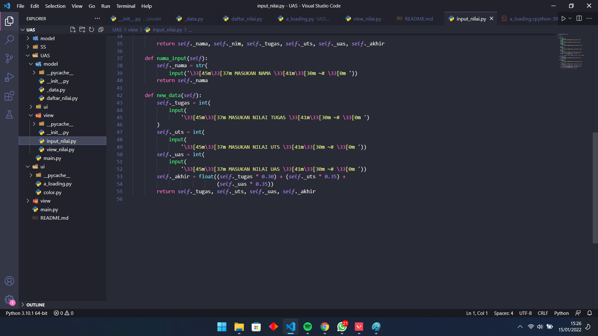

# <p align="center"> UJIAN AKHIR SEMESTER 1 BAHASA PEMOGRAMAN

```sh
Nama :Irfan Maulana Falah
NIM : 312110560
Mata Kuliah : Bahasa Pemograman
```

# [daftar_nilai]
1. Gunakan from untuk akses folder view dan akses file view_nilai dan akses parameter class view
2. Gunakan from untuk akses folder view dan akses file _input.nilai_ dan akses parameter class input_data
3. Gunakan from untuk akses folder model dan akses file _data_ dan akses parameter class view

deklarasikan l sebagai load
deklarasikan p sebagai view

buat _class_ untuk daftar yang akan menjadi menu
1. Gunakan fungsi _def tambah data_ untuk akses class _input data_ dan class _data_
2. Gunakan fungsi _def ubah data_ dan isi dengan cetak isi dari dictionary
3. Gunakan fungsi _def ubah data_ dan isi dengan inputan _nama_ dan mengubah isi dari element _nama_ tersebut
4. Gunakan fungsi _def hapus data_ dan isi dengan inputan _nama_  untuk menghapus element dari _nama_ tersebut
5. Gunakan fungsi _def cari data_  dan isi dengan inputan _nama_ untuk mencari _nama_ didalam data






# [input_nilai]
Gunakan _from_ untuk akses folder view dan akses file view.nilai dan gunakan _import_ untuk akses parameter class

Deklarasikan variabel p untuk class _view_

**Input Data**
1. Buat class dengan nama _input data_
2. Gunakan fungsi _def data input_ untuk membuat inputan data yang akan dimasukan seperti _nama_, _NIM_, _nilai tugas_, _nilai UTS_, _nilai UAS_.
3. Membuat variable _nilai akhir_ yang meliputi 30% nilai tugas, + 35% UTS + 35% UAS\


**Input Nama**
1. Gunakan fungsi _def nama input_ untuk meminta pengguna memasukan nama didalam data

**Input New Data**
1. Gunakan fungsi _def new data_ untuk meminta pengguna memasukan data baru dari nama yang telah di input





